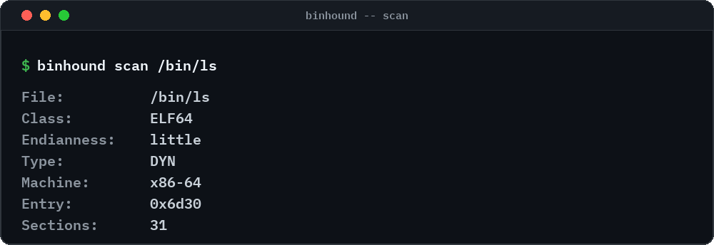

<div align="center">

<picture>
  <source media="(prefers-color-scheme: dark)" srcset="assets/banner-dark.svg">
  
</picture>

[](https://github.com/kiyx/binhound/actions/workflows/ci.yml)
[](https://github.com/kiyx/binhound/actions/workflows/codeql.yml)
[](LICENSE)
[](#compilazione)
[](CONTRIBUTING.md)
[](https://scorecard.dev/viewer/?uri=github.com/kiyx/binhound)

**[Cos'e'](#cose) · [Funzionalita'](#funzionalita) · [Avvio rapido](#avvio-rapido) · [Uso](#uso) · [Come funziona](#come-funziona) · [Roadmap](#roadmap) · [Contributors](#contributors) · [Contribuire](#contribuire)**

</div>

---

## Cos'e'

BinHound e' un analizzatore statico per binari compilati e firmware. Dato un file di cui non
esiste il codice sorgente, ricostruisce l'inventario del software: quali componenti ci sono
dentro, quali versioni sono dimostrabili, quale crittografia viene usata e quali vulnerabilita'
note si applicano — ogni risultato con l'evidenza che lo sostiene e un livello di confidenza.

Nasce per l'era del **Cyber Resilience Act europeo** e della **migrazione post-quantistica**,
dove sapere cosa c'e' dentro un prodotto e' un requisito legale e pratico, non un'opzione.

## Funzionalita'

- **Inventario dei componenti (SBOM).** Librerie e versioni rilevate da stringhe, simboli e
  impronte binarie.
- **Inventario crittografico (CBOM).** Algoritmi, protocolli e certificati, per il post-quantum.
- **Confronto vulnerabilita'.** Componenti collegati ai dati OSV/CVE e riportati separatamente
  come VEX.
- **Evidenza e confidenza ovunque.** Niente indovinelli: ogni risultato dice perche' e' stato
  rilevato e quanto e' certo.
- **Scorecard di copertura.** Ogni report dichiara quanta parte del file e' stata analizzabile.
- **Output standard.** CycloneDX SBOM, CBOM e VEX, piu' un report leggibile.
- **Sicuro per impostazione predefinita.** Il file analizzato non viene mai eseguito; nessun
  accesso alla rete se non richiesto.

## Avvio rapido

Requisiti: CMake 3.28+, Ninja, compilatore C++20 (GCC 13+ o Clang 18+).

```bash
git clone https://github.com/kiyx/binhound.git
cd binhound
cmake --workflow --preset debug      # configure, build e test
```

Build di release con LTO e hardening:

```bash
cmake --preset release
cmake --build --preset release
cmake --install build/release --prefix "$HOME/.local"
binhound --help
```

## Uso

<p align="center">
  
</p>

```bash
binhound scan /bin/ls
```

```
File:       /bin/ls
Class:      ELF64
Endianness: little
Type:       DYN
Machine:    x86-64
Entry:      0x6d30
Sections:   31
```

Exit code: `0` successo, `1` risultati, `2` errore — adatti a script e CI.

## Come funziona

```
binario ──► parsing ──► estrazione indizi ──► rilevamento ──► report
            ELF        stringhe, simboli,     regole e       CycloneDX,
                       Build-ID               confidenza     copertura, testo
```

Il cuore e' una libreria C++20 (`binhound_core`); la riga di comando e' solo un adattatore.
Ogni risultato porta con se' evidenza e confidenza, e ogni report dichiara la copertura.

## Principi di progetto

- **Prima l'evidenza.** Un risultato senza evidenza non e' un risultato.
- **Copertura onesta.** I report dichiarano cosa non e' stato analizzabile; una copertura bassa
  e' un risultato, non un fallimento.
- **Aperto e ispezionabile.** Apache-2.0, nessuna logica di rilevamento chiusa.
- **Sicuro per impostazione predefinita.** Nessuna esecuzione, nessun accesso alla rete se non
  richiesto.

## Roadmap

> **Stato: sviluppo iniziale.** Oggi funziona l'analisi dell'header ELF; rilevamento componenti
> ed export SBOM sono il prossimo traguardo. Ogni milestone si chiude con una release taggata.

| Versione | Obiettivo |
| :--- | :--- |
| **v0.1** | Parsing ELF, stringhe, simboli e Build-ID, rilevamento a firme, SBOM CycloneDX, scorecard di copertura |
| v0.2 | CBOM, metadati Go/Rust, database firme automatico |
| v0.3 | Vulnerabilita' (OSV) e VEX |
| v0.4 | Report di prontezza CRA |
| Dopo | Supporto PE e firmware, modulo sanitario (DICOM) |

## Costruito con

- [doctest](https://github.com/doctest/doctest) - test unitari
- [tl::expected](https://github.com/TartanLlama/expected) - gestione errori
- [CMake](https://cmake.org) e [Ninja](https://ninja-build.org) - sistema di build
- [CycloneDX](https://cyclonedx.org) - formati SBOM, CBOM e VEX
- [OpenSSF Scorecard](https://scorecard.dev) - postura di sicurezza del repository

## Contributors

Grazie a chiunque abbia contribuito a BinHound.

<p align="center">
  <a href="https://github.com/kiyx/binhound/graphs/contributors">
    
  </a>
</p>

## Contribuire

Segnalazioni di bug, piccole correzioni, test, documentazione e **proposte di funzionalita'**
sono benvenuti. Apri prima una issue o una discussione; vedi [CONTRIBUTING.md](CONTRIBUTING.md)
per flusso di lavoro e gate di qualita', e [CODE_OF_CONDUCT.md](CODE_OF_CONDUCT.md) per le
regole della community.

## Sicurezza

Segnala le vulnerabilita' in privato; vedi [SECURITY.md](SECURITY.md).

## Licenza

Apache-2.0 — vedi [LICENSE](LICENSE). Se usi BinHound in un lavoro, vedi [CITATION.cff](CITATION.cff).
